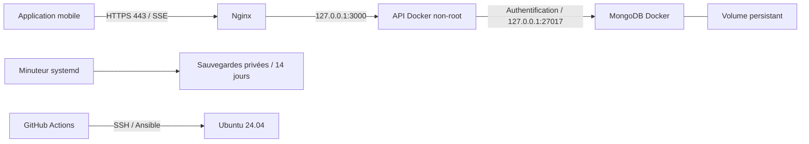

# LogiChain — infrastructure DevOps

Ce dossier répond à la partie 3 de `LogiChain-3.pdf`. L'API et le mobile sont
conservés dans le monorepo ; les workflows GitHub doivent rester dans
`.github/workflows` à sa racine pour être détectés.

## Livrables

Les résultats des contrôles locaux et la recette restante sont consignés dans
[VALIDATION.md](VALIDATION.md).

| Consigne | Réalisation |
| --- | --- |
| Espace partagé, Gitflow, PR et commits | `../CONTRIBUTING.md`, `github/branch-protection.json`, `github/configure.sh` |
| Installation et environnement | `../README.md`, `../TP3-M2-APi/.env.example`, ce guide |
| Système et sécurité | rôle `system_security` : paquets, comptes, SSH par clé, UFW, Fail2Ban |
| MongoDB sécurisé | rôle `database` : volume persistant, authentification, compte `readWrite` limité à `logichain` |
| Indexation initiale | `Database.connect()` attend `createIndexes()` des modèles avant l'écoute HTTP, sans supprimer d'index |
| Runtime | Dockerfile multi-étapes, dépendances de production, utilisateur non-root, limites et supervision Docker |
| Reverse proxy et TLS | rôle `web_proxy`, certificat fourni, redirection HTTPS, prise en charge SSE |
| CI | lint API/mobile, typage, tests unitaires et d'intégration, build Docker, validation Ansible |
| CD | CI préalable, publication GHCR et déploiement Ansible avec digest, environnement `production` |
| Reprise d'activité | [RUNBOOK.md](RUNBOOK.md), rollback, sauvegarde quotidienne, restauration |

## Architecture cible



L'API utilise le réseau hôte et écoute uniquement sur loopback. MongoDB publie
uniquement sur `127.0.0.1`, pour éviter qu'une publication Docker n'expose la base
en contournant UFW. Seuls SSH (réseau autorisé), HTTP et HTTPS sont accessibles.
Les conteneurs redémarrent avec Docker ; les journaux sont limités à 3 × 10 Mo.
Le compte `deploy` administre via sudo et doit donc être traité comme privilégié.
Le compte de service `logichain` n'a pas de shell ; l'API tourne avec l'UID 1000
interne à l'image, sans privilèges ni écriture dans son système de fichiers.

## Préparer GitHub

Le dossier livré ne prouve pas l'existence d'un dépôt distant. Depuis la racine,
après vérification des fichiers et configuration de son identité Git :

```bash
git init -b main
git add .
git status --short
git commit -m "build: preparer LogiChain et son infrastructure DevOps"
git branch develop
git remote add origin git@github.com:PROPRIETAIRE/DEPOT.git
git push -u origin main
git push -u origin develop
```

Créer d'abord le dépôt GitHub vide. Puis, avec `gh auth login` et un compte
administrateur du dépôt, appliquer les protections :

```bash
GITHUB_REPOSITORY=PROPRIETAIRE/DEPOT bash TP3-M2-GIT/github/configure.sh
```

Le script applique les mêmes règles à `main` et `develop`. La disponibilité des
protections et des approbations d'environnement dépend du plan GitHub ; vérifier
leur présence dans Settings. Créer l'environnement `production`, limiter ses
branches de déploiement à `main` et sélectionner un approbateur de l'équipe.
Si l'approbation d'environnement n'est pas disponible, le merge de la PR revue
sur `main` est la validation précédant le déploiement automatique.

## Préparer le serveur et les accès

Cible : un serveur **Ubuntu 24.04 LTS amd64**, SSH et Python 3 disponibles,
avec un utilisateur initial ayant sudo. Le DNS du domaine doit pointer dessus.
Ansible configure le système ; la création de la VM chez un hébergeur et
l'enregistrement DNS restent des prérequis, aucun fournisseur n'étant imposé.

Depuis un contrôleur Linux/WSL équipé de Python 3, `venv` et OpenSSH :

```bash
cd TP3-M2-GIT/ansible
python3 -m venv .venv
. .venv/bin/activate
pip install -r requirements.txt
ansible-galaxy collection install -r requirements.yml
ansible-playbook site.yml --syntax-check
ansible-playbook rollback.yml --syntax-check
ansible-lint
```

Le Dockerfile de ce dossier fournit aussi un contrôleur Linux pour les validations
depuis Windows : voir [VALIDATION.md](VALIDATION.md).

## Variables requises

Exporter ces variables sur le contrôleur, sans enregistrer leurs valeurs dans Git.
Utiliser un gestionnaire de secrets ou un fichier privé hors dépôt chargé dans
le shell avec `set -a; . /chemin/prive/deploy.env; set +a`.

| Variable | Usage |
| --- | --- |
| `DEPLOY_HOST` | IP ou nom SSH du serveur |
| `DEPLOY_USER` | utilisateur initial au premier passage ; `deploy` ensuite |
| `DEPLOY_PUBLIC_KEY` | clé publique SSH qui sera installée pour `deploy` |
| `SSH_ALLOWED_CIDR` | réseau d'administration autorisé sur le port 22, incluant le contrôleur |
| `API_DOMAIN` | domaine DNS de l'API, sans protocole ni chemin |
| `API_IMAGE` | `ghcr.io/proprietaire/depot/api@sha256:<64 caractères hexadécimaux>` |
| `MONGO_ADMIN_PASSWORD` | mot de passe administrateur MongoDB, au moins 32 caractères |
| `MONGO_APP_PASSWORD` | autre mot de passe, au moins 32 caractères, compte applicatif |
| `JWT_SECRET` | au moins 32 caractères alphanumériques, `_` ou `-` ; 64 caractères aléatoires recommandés |
| `TLS_CERTIFICATE_FILE` | chemin local vers la chaîne PEM du certificat public valide |
| `TLS_PRIVATE_KEY_FILE` | chemin local vers sa clé privée PEM |

Générer chaque secret séparément avec `openssl rand -hex 32`. Les mots de passe
MongoDB sont encodés dans les URI ; les secrets ne sont pas affichés par Ansible.
Les fichiers privés du serveur appartiennent à root avec les permissions 0600.
Ne pas exécuter Ansible avec une journalisation de débogage exposant les variables.

Installer la clé privée correspondante dans l'agent SSH du contrôleur. Renseigner
`~/.ssh/known_hosts` après comparaison de l'empreinte avec la console de
l'hébergeur. La vérification des clés d'hôtes reste activée.

Le paquet GHCR doit être **public** pour que le serveur puisse récupérer l'image
sans jeton de registre. Après la première publication CI, régler cette visibilité
dans les paramètres du paquet, puis relancer le job de déploiement. Si le code doit
rester privé, configurer d'abord une authentification de registre sur le serveur
avec un jeton limité à `read:packages` ; ne pas utiliser un jeton d'écriture.

## Déploiement en une commande

Une fois le contrôleur, les variables, l'image et le certificat prêts :

```bash
ansible-playbook site.yml
```

Cette même commande reconstruit la configuration sur une nouvelle VM Ubuntu
vierge et déploie l'image indiquée. Pour le premier passage, utiliser le compte
fourni par l'hébergeur (`DEPLOY_USER=ubuntu`, par exemple) et `--ask-become-pass`
si son sudo nécessite un mot de passe. La clé de `deploy` est installée avant la
désactivation des accès SSH par mot de passe/root. Garder la console hébergeur
ouverte et vérifier une nouvelle connexion `deploy` avant de fermer l'ancienne.

Les rôles utilisent des modules Ansible natifs, aucun `shell`/`command` Ansible.
Une seconde exécution garde utilisateurs, volumes, configuration et conteneurs
inchangés lorsque versions, variables et paquets disponibles restent identiques.
Les mises à jour système peuvent produire un changement légitime plus tard.
Les restaurations et sauvegardes déclenchées explicitement sont des opérations
d'exploitation, distinctes du provisionnement idempotent.

## Paramétrer la CD

Le déploiement serveur reste désactivé tant que la variable de dépôt GitHub
`DEPLOY_ENABLED` n'est pas définie à `true`. La CI fonctionne indépendamment.
Activer cette variable seulement après la préparation du serveur et des secrets.

Dans l'environnement GitHub `production`, ajouter les variables `DEPLOY_HOST`,
`DEPLOY_PUBLIC_KEY`, `SSH_ALLOWED_CIDR`, `API_DOMAIN` et les secrets suivants :

- `DEPLOY_SSH_KEY` : clé privée du compte `deploy`.
- `SSH_KNOWN_HOSTS` : ligne de clé d'hôte préalablement vérifiée.
- `MONGO_ADMIN_PASSWORD`, `MONGO_APP_PASSWORD`, `JWT_SECRET`.
- `TLS_CERTIFICATE`, `TLS_PRIVATE_KEY` : contenu PEM, pas un chemin de fichier.

Le bootstrap du compte `deploy` se fait une première fois depuis le contrôleur
local. Le workflow utilise ensuite ce compte. Les runners GitHub hébergés ont
des IP variables : utiliser un runner administré avec IP fixe et adapter
`runs-on` pour restreindre SSH à un CIDR stable. Avec les runners hébergés de ce
workflow, le pare-feu doit explicitement permettre leur réseau ; `0.0.0.0/0`
permet leur accès mais expose SSH à Internet, toujours protégé par clé et Fail2Ban.

À chaque push sur `main`, la CI réutilisable vérifie le commit, puis publie l'image
et transmet son digest au job de déploiement. L'environnement protège l'accès aux
secrets. Une seule CD s'exécute à la fois. Un lancement manuel depuis une autre
branche ne peut pas publier/déployer. Les PR, y compris celles de forks, n'accèdent
pas aux secrets de production. Le front mobile est testé ; sa distribution sur
les stores est distincte du déploiement serveur demandé par le sujet.

Sources techniques : [modules Docker Ansible](https://docs.ansible.com/projects/ansible/latest/collections/community/docker/index.html),
[gestion des utilisateurs MongoDB](https://docs.ansible.com/projects/ansible/latest/collections/community/mongodb/mongodb_user_module.html).
