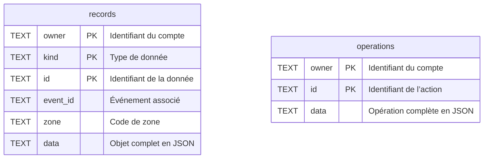
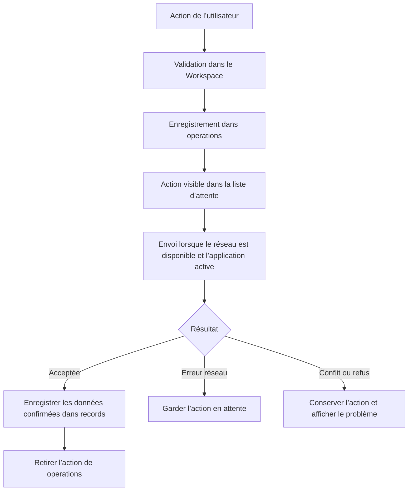

# Schéma de la base locale — LogiChain

Le frontend utilise **SQLite**, dans le fichier `logichain-mobile-v2.db`, pour conserver les données et les actions hors ligne. Cette documentation décrit la base du téléphone ; les modèles de la base MongoDB côté API sont dans [src/models](../TP3-M2-APi/src/models/).

## Les deux tables



Les champs marqués `PK` forment une **clé primaire composée** : `(owner, kind, id)` pour `records` et `(owner, id)` pour `operations`. Aucune clé étrangère n’est déclarée dans SQLite.

### `records` : les informations disponibles sur le téléphone

Chaque ligne contient un objet téléchargé. La colonne `kind` indique sa catégorie :

| Valeur de `kind` | Contenu du JSON `data` |
| --- | --- |
| `events` | Événement et ses zones |
| `items` | Équipement |
| `tasks` | Tâche |
| `deliveries` | Livraison et ses étapes |
| `anomalies` | Anomalie |
| `notifications` | Notification |
| `people` | Personne : identifiant, nom, rôle et événements associés |

`owner` désigne le compte auquel appartient la copie locale. `id` reprend le champ `_id` de l’objet. `event_id` et `zone` reprennent respectivement `eventId` et `zoneCode` lorsque ces propriétés existent ; le code utilise une chaîne vide si la propriété est absente.

Un index `records_sector` sur `(owner, event_id, zone)` facilite la recherche des données d’un secteur. La fonction `sectorItems` relie les équipements aux événements par une jointure sur cette même table : compte identique et `items.event_id = events.id`. Ce lien est utilisé par le code, sans contrainte de clé étrangère.

### `operations` : les actions à envoyer

La colonne `data` contient l’opération complète sous forme de texte JSON. Les propriétés ci-dessous sont dans ce JSON, **pas dans des colonnes SQL séparées**.

| Propriété | Rôle |
| --- | --- |
| `id` | Identifiant de l’action, également enregistré dans la colonne `id` |
| `kind` | `item`, `task`, `delivery` ou `anomaly` |
| `entityId` | Identifiant de la cible |
| `expected` | Version connue de la cible, issue de son champ `updatedAt` |
| `action` | Action demandée, par exemple `scanned` ou `status` |
| `data` | Informations nécessaires à la modification |
| `state` | `pending` : en attente ; `conflict` : conflit ; `failed` : refus |
| `createdAt` | Date de création de l’action |
| `error` | Message d’erreur, si présent |
| `current` | Version distante reçue, si présente |

Les actions sont relues par compte dans l’ordre de `rowid`. La cible est interprétée par le code à partir de `kind` et `entityId`. Pour un signalement d’anomalie, la cible est l’équipement concerné.

## Le rôle de la base dans le mode hors ligne



À la réouverture, l’application relit `records` et `operations` pour le compte connecté. L’affichage combine les données téléchargées avec les modifications en attente applicables. La session est conservée séparément avec Keychain, pas dans ces deux tables.

## Définition SQL

Ce SQL correspond aux instructions de création utilisées par le frontend :

```sql
CREATE TABLE IF NOT EXISTS records (
    owner TEXT,
    kind TEXT,
    id TEXT,
    event_id TEXT,
    zone TEXT,
    data TEXT,
    PRIMARY KEY (owner, kind, id)
);

CREATE INDEX IF NOT EXISTS records_sector
    ON records (owner, event_id, zone);

CREATE TABLE IF NOT EXISTS operations (
    owner TEXT,
    id TEXT,
    data TEXT,
    PRIMARY KEY (owner, id)
);
```

## Fichiers de référence

- [storage/mobile.ts](../TP3-M2-Front/src/storage/mobile.ts) : création des tables, lectures et écritures SQLite.
- [types/mobile.ts](../TP3-M2-Front/src/types/mobile.ts) : structure des données et des opérations.
- [services/workspace.ts](../TP3-M2-Front/src/services/workspace.ts) : enregistrement, synchronisation et résolution des conflits.
- [services/operations.ts](../TP3-M2-Front/src/services/operations.ts) : validation et affichage des modifications en attente.
- [services/client.ts](../TP3-M2-Front/src/services/client.ts) : conservation de la session avec Keychain.
